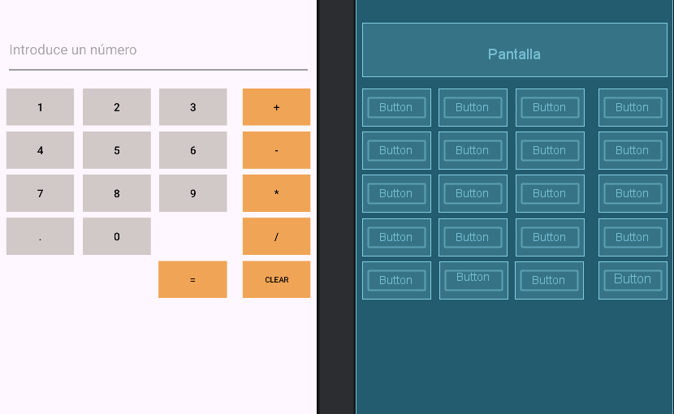
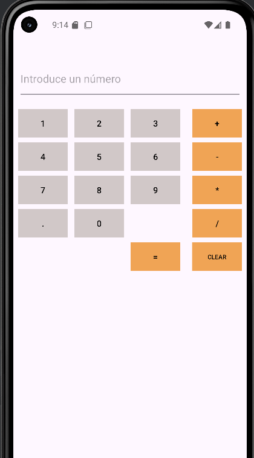

 # Practica Calculadora

## Índice

---

**1. [Comentarios interesantes / Problemas](#1-comentarios-interesantes--problemas)**  
**2. [Diseño de la Aplicación](#2-diseño-de-la-aplicación)**  
**3. [Ejecución de la Aplicación](#3-ejecución-de-la-aplicación)**  
**4. [Código XML del Diseño](#4-código-xml-del-diseño)**

---

## 1. Comentarios interesantes / Problemas
Los principales problemas al realizar el diseño de la app han sido:

- **Me costó aplicar ConstraintLayout y encadenar los elementos correctamente**: Me costó aplicar ConstraintLayout y encadenar correctamente los elementos, por lo que los botones no se alineaban como quería.

- **Los colores de los botones no se mostraban como esperaba**: Los colores de los botones no se mostraban correctamente, incluso al usar backgroundTint.

- **Problemas con selectores y estilos (selector, background, backgroundTint)**: Tuve problemas con los selectores (selector) y cómo aplicarlos para que los botones mostraran colores distintos en estados normal y presionado.

- **Encadenamiento vertical**:Al usar vertical_chainStyle="packed" algunas columnas o botones se quedaban pegados arriba o abajo y no se centraban como quería.


## 2. Diseño de la Aplicación


## 3. Ejecución de la Aplicación


## 4. Código XML del Diseño

### **activity-main.xml**

```xml
<?xml version="1.0" encoding="utf-8"?>
<androidx.constraintlayout.widget.ConstraintLayout xmlns:android="http://schemas.android.com/apk/res/android"
    xmlns:app="http://schemas.android.com/apk/res-auto"
    xmlns:tools="http://schemas.android.com/tools"
    android:id="@+id/main"
    android:layout_width="match_parent"
    android:layout_height="match_parent"
    tools:layout_editor_absoluteX="8dp"
    tools:layout_editor_absoluteY="-32dp">

    <EditText
        android:id="@+id/Pantalla"
        android:layout_width="0dp"
        android:layout_height="69dp"
        android:layout_marginStart="8dp"
        android:layout_marginTop="80dp"
        android:layout_marginEnd="8dp"
        android:hint="@string/Pantalla"
        android:inputType="text"
        android:textColor="@android:color/black"
        app:layout_constraintBottom_toTopOf="@+id/button1"
        app:layout_constraintEnd_toEndOf="parent"
        app:layout_constraintStart_toStartOf="parent"
        app:layout_constraintTop_toTopOf="parent"
        app:layout_constraintVertical_chainStyle="packed" />

    <Button
        android:id="@+id/button1"
        android:layout_width="0dp"
        android:layout_height="48dp"
        android:layout_marginStart="8dp"
        android:layout_marginTop="16dp"
        android:layout_marginEnd="3dp"
        android:background="@drawable/boton_cuadrado"
        android:textColor="#000000"
        app:backgroundTint="@null"
        android:text="@string/button1"
        app:layout_constraintBottom_toTopOf="@id/button4"
        app:layout_constraintEnd_toStartOf="@+id/button2"
        app:layout_constraintHorizontal_chainStyle="spread"
        app:layout_constraintStart_toStartOf="parent"
        app:layout_constraintTop_toBottomOf="@id/Pantalla"
        app:layout_constraintVertical_chainStyle="packed" />

    <Button
        android:id="@+id/button2"
        android:layout_width="0dp"
        android:layout_height="48dp"
        android:layout_marginStart="8dp"
        android:layout_marginTop="16dp"
        android:layout_marginEnd="8dp"
        android:background="@drawable/boton_cuadrado"
        android:textColor="#000000"
        app:backgroundTint="@null"
        android:text="@string/button2"
        app:layout_constraintBottom_toTopOf="@id/button5"
        app:layout_constraintEnd_toStartOf="@id/button3"
        app:layout_constraintStart_toEndOf="@id/button1"
        app:layout_constraintTop_toBottomOf="@id/Pantalla"
        app:layout_constraintVertical_bias="0.0"
        app:layout_constraintVertical_chainStyle="packed" />

    <Button
        android:id="@+id/button3"
        android:layout_width="0dp"
        android:layout_height="48dp"
        android:layout_marginStart="3dp"
        android:layout_marginTop="16dp"
        android:layout_marginEnd="12dp"
        android:background="@drawable/boton_cuadrado"
        android:textColor="#000000"
        app:backgroundTint="@null"
        android:text="@string/button3"
        app:layout_constraintBottom_toTopOf="@+id/button6"
        app:layout_constraintEnd_toStartOf="@+id/buttonSumar"
        app:layout_constraintHorizontal_bias="0.5"
        app:layout_constraintStart_toEndOf="@id/button2"
        app:layout_constraintTop_toBottomOf="@+id/Pantalla"
        app:layout_constraintVertical_bias="0.0"
        app:layout_constraintVertical_chainStyle="packed" />

    <Button
        android:id="@+id/button4"
        android:layout_width="0dp"
        android:layout_height="48dp"
        android:layout_marginStart="8dp"
        android:layout_marginTop="8dp"
        android:layout_marginEnd="3dp"
        android:background="@drawable/boton_cuadrado"
        android:textColor="#000000"
        app:backgroundTint="@null"
        android:text="@string/button4"
        app:layout_constraintBottom_toTopOf="@id/button7"
        app:layout_constraintEnd_toStartOf="@+id/button5"
        app:layout_constraintHorizontal_bias="0.0"
        app:layout_constraintHorizontal_chainStyle="spread"
        app:layout_constraintStart_toStartOf="parent"
        app:layout_constraintTop_toBottomOf="@id/button1" />

    <Button
        android:id="@+id/button5"
        android:layout_width="0dp"
        android:layout_height="48dp"
        android:layout_marginStart="8dp"
        android:layout_marginTop="8dp"
        android:layout_marginEnd="8dp"
        android:background="@drawable/boton_cuadrado"
        android:textColor="#000000"
        app:backgroundTint="@null"
        android:text="@string/button5"
        app:layout_constraintBottom_toTopOf="@id/button8"
        app:layout_constraintEnd_toStartOf="@id/button6"
        app:layout_constraintStart_toEndOf="@id/button4"
        app:layout_constraintTop_toBottomOf="@id/button2" />

    <Button
        android:id="@+id/button6"
        android:layout_width="0dp"
        android:layout_height="48dp"
        android:layout_marginStart="3dp"
        android:layout_marginTop="8dp"
        android:layout_marginEnd="12dp"
        android:background="@drawable/boton_cuadrado"
        android:textColor="#000000"
        app:backgroundTint="@null"
        android:text="@string/button6"
        app:layout_constraintBottom_toTopOf="@+id/button9"
        app:layout_constraintEnd_toStartOf="@+id/buttonRestar"
        app:layout_constraintHorizontal_bias="0.5"
        app:layout_constraintStart_toEndOf="@id/button5"
        app:layout_constraintTop_toBottomOf="@+id/button3" />

    <Button
        android:id="@+id/button7"
        android:layout_width="0dp"
        android:layout_height="48dp"
        android:layout_marginStart="8dp"
        android:layout_marginTop="8dp"
        android:layout_marginEnd="3dp"
        android:background="@drawable/boton_cuadrado"
        android:textColor="#000000"
        app:backgroundTint="@null"
        android:text="@string/button7"
        app:layout_constraintBottom_toTopOf="@id/buttonpunto"
        app:layout_constraintEnd_toStartOf="@+id/button8"
        app:layout_constraintHorizontal_chainStyle="spread"
        app:layout_constraintStart_toStartOf="parent"
        app:layout_constraintTop_toBottomOf="@id/button4" />

    <Button
        android:id="@+id/button8"
        android:layout_width="0dp"
        android:layout_height="48dp"
        android:layout_marginStart="8dp"
        android:layout_marginTop="8dp"
        android:layout_marginEnd="8dp"
        android:background="@drawable/boton_cuadrado"
        android:textColor="#000000"
        app:backgroundTint="@null"
        android:text="@string/button8"
        app:layout_constraintBottom_toTopOf="@id/button0"
        app:layout_constraintEnd_toStartOf="@id/button9"
        app:layout_constraintStart_toEndOf="@id/button7"
        app:layout_constraintTop_toBottomOf="@id/button5" />

    <Button
        android:id="@+id/button9"
        android:layout_width="0dp"
        android:layout_height="48dp"
        android:layout_marginStart="3dp"
        android:layout_marginTop="8dp"
        android:layout_marginEnd="12dp"
        android:background="@drawable/boton_cuadrado"
        android:textColor="#000000"
        app:backgroundTint="@null"
        android:text="@string/button9"
        app:layout_constraintBottom_toTopOf="@+id/buttonNovisible1"
        app:layout_constraintEnd_toStartOf="@+id/buttonMultiplicar"
        app:layout_constraintHorizontal_bias="0.5"
        app:layout_constraintStart_toEndOf="@id/button8"
        app:layout_constraintTop_toBottomOf="@+id/button6" />

    <Button
        android:id="@+id/button0"
        android:layout_width="0dp"
        android:layout_height="48dp"
        android:layout_marginStart="8dp"
        android:layout_marginTop="8dp"
        android:layout_marginEnd="8dp"
        android:background="@drawable/boton_cuadrado"
        android:textColor="#000000"
        app:backgroundTint="@null"
        android:text="@string/button0"
        app:layout_constraintBottom_toTopOf="@id/buttonNovisible2"
        app:layout_constraintEnd_toStartOf="@id/buttonNovisible1"
        app:layout_constraintStart_toEndOf="@id/buttonpunto"
        app:layout_constraintTop_toBottomOf="@id/button8" />

    <Button
        android:id="@+id/buttonpunto"
        android:layout_width="0dp"
        android:layout_height="48dp"
        android:layout_marginStart="8dp"
        android:layout_marginTop="8dp"
        android:layout_marginEnd="3dp"
        android:background="@drawable/boton_cuadrado"
        android:textColor="#000000"
        app:backgroundTint="@null"
        android:text="@string/buttonpunto"
        app:layout_constraintBottom_toTopOf="@id/buttonNovisible"
        app:layout_constraintEnd_toStartOf="@+id/button0"
        app:layout_constraintHorizontal_chainStyle="spread"
        app:layout_constraintStart_toStartOf="parent"
        app:layout_constraintTop_toBottomOf="@id/button7" />

    <!-- Botones invisibles -->
    <Button
        android:id="@+id/buttonNovisible"
        android:layout_width="0dp"
        android:layout_height="48dp"
        android:layout_marginStart="8dp"
        android:layout_marginTop="8dp"
        android:layout_marginEnd="3dp"
        android:text=""
        android:visibility="invisible"
        app:layout_constraintBottom_toTopOf="@id/buttonresultado"
        app:layout_constraintEnd_toStartOf="@id/buttonNovisible2"
        app:layout_constraintStart_toStartOf="parent"
        app:layout_constraintTop_toBottomOf="@id/buttonpunto" />

    <Button
        android:id="@+id/buttonNovisible1"
        android:layout_width="0dp"
        android:layout_height="48dp"
        android:layout_marginStart="3dp"
        android:layout_marginTop="8dp"
        android:layout_marginEnd="12dp"
        android:visibility="invisible"
        app:layout_constraintBottom_toTopOf="@+id/buttonresultado"
        app:layout_constraintEnd_toStartOf="@id/buttondividir"
        app:layout_constraintHorizontal_bias="0.5"
        app:layout_constraintStart_toEndOf="@id/button0"
        app:layout_constraintTop_toBottomOf="@+id/button9" />

    <Button
        android:id="@+id/buttonNovisible2"
        android:layout_width="0dp"
        android:layout_height="48dp"
        android:layout_marginStart="8dp"
        android:layout_marginTop="8dp"
        android:layout_marginEnd="8dp"
        android:text="@string/buttonNovisible2"
        android:visibility="invisible"
        app:layout_constraintBottom_toBottomOf="parent"
        app:layout_constraintEnd_toStartOf="@id/buttonresultado"
        app:layout_constraintStart_toEndOf="@id/buttonNovisible"
        app:layout_constraintTop_toBottomOf="@id/button0" />

    <!-- Operadores -->
    <Button
        android:id="@+id/buttonSumar"
        android:layout_width="0dp"
        android:layout_height="48dp"
        android:layout_marginStart="8dp"
        android:layout_marginTop="16dp"
        android:layout_marginEnd="8dp"
        android:background="@drawable/boton_operadores"
        android:textColor="#000000"
        app:backgroundTint="@null"
        android:text="@string/buttonsumar"
        app:layout_constraintBottom_toTopOf="@+id/buttonRestar"
        app:layout_constraintEnd_toEndOf="parent"
        app:layout_constraintHorizontal_bias="0.5"
        app:layout_constraintStart_toEndOf="@id/button3"
        app:layout_constraintTop_toBottomOf="@+id/Pantalla"
        app:layout_constraintVertical_bias="0.0"
        app:layout_constraintVertical_chainStyle="packed" />

    <Button
        android:id="@+id/buttonRestar"
        android:layout_width="0dp"
        android:layout_height="48dp"
        android:layout_marginStart="8dp"
        android:layout_marginTop="8dp"
        android:background="@drawable/boton_operadores"
        android:textColor="#000000"
        app:backgroundTint="@null"
        android:text="@string/buttonrestar"
        app:layout_constraintBottom_toTopOf="@+id/buttonMultiplicar"
        app:layout_constraintEnd_toEndOf="@id/buttonSumar"
        app:layout_constraintHorizontal_bias="0.5"
        app:layout_constraintStart_toEndOf="@+id/button6"
        app:layout_constraintTop_toBottomOf="@+id/buttonSumar" />

    <Button
        android:id="@+id/buttonMultiplicar"
        android:layout_width="0dp"
        android:layout_height="48dp"
        android:layout_marginStart="8dp"
        android:layout_marginTop="8dp"
        android:layout_marginEnd="8dp"
        android:background="@drawable/boton_operadores"
        android:textColor="#000000"
        app:backgroundTint="@null"
        android:text="@string/buttonmultiplicar"
        app:layout_constraintBottom_toTopOf="@+id/buttondividir"
        app:layout_constraintEnd_toEndOf="parent"
        app:layout_constraintHorizontal_bias="0.5"
        app:layout_constraintStart_toEndOf="@id/button9"
        app:layout_constraintTop_toBottomOf="@+id/buttonRestar" />

    <Button
        android:id="@+id/buttondividir"
        android:layout_width="0dp"
        android:layout_height="48dp"
        android:layout_marginStart="8dp"
        android:layout_marginTop="8dp"
        android:layout_marginEnd="8dp"
        android:background="@drawable/boton_operadores"
        android:textColor="#000000"
        app:backgroundTint="@null"
        android:text="@string/buttondividir"
        app:layout_constraintBottom_toTopOf="@+id/buttonborrar"
        app:layout_constraintEnd_toEndOf="parent"
        app:layout_constraintHorizontal_bias="0.5"
        app:layout_constraintStart_toEndOf="@+id/buttonNovisible1"
        app:layout_constraintTop_toBottomOf="@+id/buttonMultiplicar" />

    <!-- Resultado y Borrar -->
    <Button
        android:id="@+id/buttonresultado"
        android:layout_width="0dp"
        android:layout_height="48dp"
        android:layout_marginStart="2dp"
        android:layout_marginTop="8dp"
        android:layout_marginEnd="12dp"
        android:background="@drawable/boton_operadores"
        android:textColor="#000000"
        app:backgroundTint="@null"
        android:text="@string/buttonresultado"
        app:layout_constraintBottom_toBottomOf="parent"
        app:layout_constraintEnd_toStartOf="@+id/buttonborrar"
        app:layout_constraintHorizontal_bias="0.5"
        app:layout_constraintStart_toEndOf="@+id/buttonNovisible2"
        app:layout_constraintTop_toBottomOf="@+id/buttonNovisible1" />

    <Button
        android:id="@+id/buttonborrar"
        android:layout_width="0dp"
        android:layout_height="48dp"
        android:layout_marginStart="8dp"
        android:layout_marginTop="8dp"
        android:layout_marginEnd="8dp"
        android:background="@drawable/boton_operadores"
        android:textColor="#000000"
        app:backgroundTint="@null"
        android:text="@string/buttonborrar"
        android:textSize="10sp"
        app:layout_constraintBottom_toBottomOf="parent"
        app:layout_constraintEnd_toEndOf="parent"
        app:layout_constraintHorizontal_bias="0.2"
        app:layout_constraintStart_toEndOf="@+id/buttonresultado"
        app:layout_constraintTop_toBottomOf="@+id/buttondividir" />

</androidx.constraintlayout.widget.ConstraintLayout>
```

### **boton-cuadrado.xml**

```xml
<selector xmlns:android="http://schemas.android.com/apk/res/android">
    <item android:state_pressed="true">
        <shape>
            <solid android:color="#FF9800" />
            <corners android:radius="0dp" />
        </shape>
    </item>


    <item>
        <shape>
            <solid android:color="#D1C8C8" />
            <corners android:radius="0dp" />
        </shape>
        <shape>
            <solid android:color="#F0A455" />
            <corners android:radius="0dp" />
        </shape>
    </item>
</selector>
```

### **boton-operadores.xml**

```xml
<?xml version="1.0" encoding="utf-8"?>
<selector xmlns:android="http://schemas.android.com/apk/res/android">
    <item android:state_pressed="true">
        <shape>
            <solid android:color="#FF9800"/> 
            <corners android:radius="0dp"/>
        </shape>
    </item>

    <item>
        <shape>
            <solid android:color="#F0A455"/> 
            <corners android:radius="0dp"/>
        </shape>
    </item>
</selector>
```
